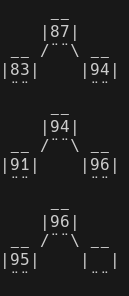
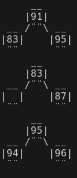
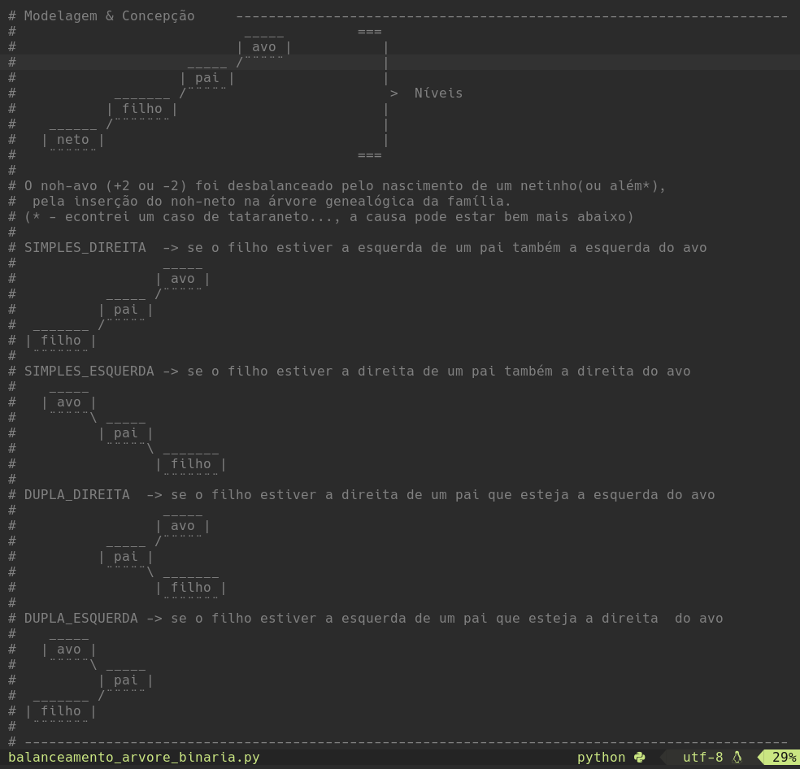
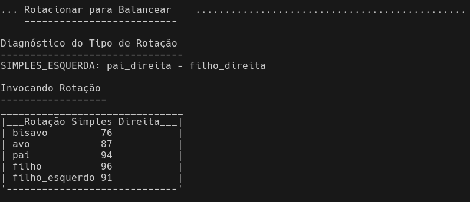
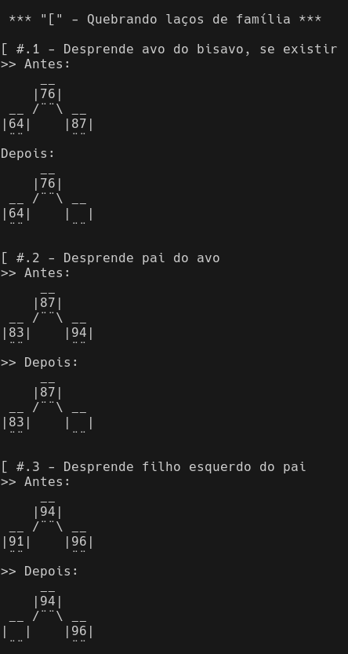
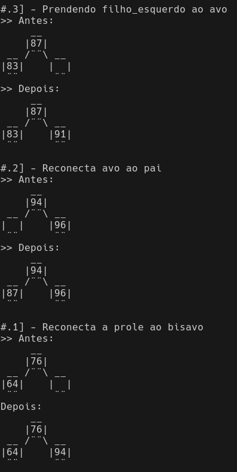

# Balanceamento de Árvore Binária

RESUMO: TODO....

### Contexto

Fatec-RioPreto/SP, 3° semestre do curso Análise e Desnvolvimento de Sistemas, estudando Listas Encadeadas e Árvores Binárias na disciplina Estrutura de Dados, do lendário Professor Dr. Carlos Magnus Carlson Filho.

Para a parte prática, o professor Carlos forneceu um código minimamente estruturado de _Listas Simplesmente Encadeadas_ em ```Python```, porém, estas classes estavam propositalmente incompletas. Após a explicação, o professor passava a complementação destas classes como atividade para nota. O estudante era desafiado a terminar as classes, implementando os métodos com as funcionalidades faltantes, tais como: inserir e remover elementos no início e no final da lista, percorrer os elementos da lista por diferentes percursos, estender o código fornecido a fim de obtermos uma _Lista Duplamente Encadeada_, entre outras.

Sedimentados os conceitos de listas encadeadas entramos em _Árvores Binárias_. Vimos dois métodos de balanceamento de árvore, o balanceamento estático e o método soviético AVL (_Adelson Velsky e Landis_). Para essa parte o professor não tinha códigos de demonstração. 
O que fizemos foi implementar em ```Python``` quatro métodos de balanceamento, os dois vistos nas aulas, o **```estático```**, o **```dinâmico russo AVL```** e mais 2 hidridos que criamos mesclando ideias dos dois anteriores, que os chamamos de **```dinâmico-estático```** e **```dinâmico-rotacional```**.

No material, o professor se utilizava sempre de uma mesma árvore binária, inseria um elemento que à desbalanceava e dai partia para explicar o algoritimo. Nosso código dá suporte à estas aulas, logo, carregamos esta árvore previamente no código e a partir dela sugerimos inserções que provocarão certos desbalanceamentos específicos. 

O grande diferencial didático é que, desde a árvore binária, todo o processo de balanceamento é desenhado passo a passo no terminal. O aluno pode acompanhar graficamente as alterações nos galhos da árvore. E depois de bem compreendido o comportamento do algoritmo de balanceamento escolhido, o estudante fica tentado a correr as linhas do código, reconhecendo as etapas do processo, aprendendo tanto os conceitos quanto a programação destes.

---
## Abertura

Na primeira tela da execução do programa mostramos a árvore binária que servirá de base para testes de todos os métodos de balanceamento. Em _Propriedades da Árvore_ imprimimos as três formas de percorrer a árvore, a quantidade de elementos, a altura ou profundidade da árvore, e por último damos o diagnóstico de que a nossa árvore de referência está balanceada.
A seguir é oferecido um menu numérico para o usuário escolher o método de balanceamento:
<br>```1 - Estático```
<br>```2 - Dinâmico-Estático```
<br>```3 - Dinâmico-Rotacional```
<br>```4 - Dinâmico Russo-AVL```
<br>```9 - Sair do programa```


<br>
<sup>_Figura 2: Árvore binária - Escolha do método de balanceamento_</sup>

Não importa o balanceamento escolhido, o segundo menu é sempre o mesmo da figura 3:
<br>```0 - Informações sobre o método``` |=> breve explicação do algoritmo
<br>```1 - Inserir valor``` |=> adiciona um nó folha à árvore
<br>```2 - Desenha galhos``` |=> percorre toda a árvore desenhando cada nó com seus nós vizinhos, à direita e à esquerda
<br>```3 - Checar balancenamento da árvore``` |=> avalia o balancenamento de cada nó, informando o nó desbalanceado se for o caso
<br>```4 - Balancear árvore binária ``` |=> executa o balanceamento e vai imprimindo todas as etapas do processo
<br>```7 - Reiniciar árvore binária original ``` |=> descarta a árvore que estiver sendo usada e recria a árvore base de testes
<br>```8 - Voltar à escolha do método de balanceamento ``` |=> retorna ao primeiro menu e reinicia a árvore
<br>```9 - Sair do programa```

<br>
<sup>_Figura 3: Escolha da ação a ser executada_</sup>

Vamos tratar agora de cada um dos métodos de balacenamento, começando pelo estático. E usaremos o balanceamento estático para mostrar o que faz as opções do segundo _menu_. Nos demais balanceamentos a ação é a mesma, então vamos destacar só alguns diferenciais.

---

## Balanceamento Estático

Único método que permite a inserção de vários valores antes de se fazer o balanceamento. Todos os demais métodos já realizam o balanceamento no momento da inserção. O que o método estático faz basicamente é remover todos os elementos da árvore para depois os reinserir em uma ordem ótima, na qual a árvore ficará balanceada. 

Para inserirmos um nó-folha - porque inicialmente este novo valor ficará em alguma extremidade, fazemos a comparação do valor do nó-folha com o nó corrente. Se o nó-folha for maior, desceremos pelo galho do lado direito, se for menor, desceremos o galho do lado esquerdo. Em uma árvore binária, cada nó pode ter apenas dois nós ligados, um de cada lado. Ao inserimos um novo valor, a árvore será percorrida recursivamente, fazendo a comparação referida, até encontrarmos uma posição vaga, à direita ou à esquerda, de um nó existente na árvore. 
<br>Vamos exemplificar que ficará mais claro.

Para desbalancear a árvore original vamos inserir três valores: 35, 37 e 5, nessa ordem, antes de fazermos o balancemanto. Começamos pelo nó raiz 44 e fazemos a comparação. 35 é maior ou menor que 44? É menor, então descemos pela esquerda até o nó 26. Novamente a comparação: 35 é maior ou menor que 26? É maior, então descemos pela direita até o nó 33. 35 é maior ou menor que 33? É maior, então descemos pela direita e como não há nenhum nó a direita do 33 o 35 encontrou o seu lugar. Ao inserirmos o 37 faremos o mesmo percurso do 35, mas dessa vez a vaga à direta do 33 agora está ocupada pelo 35, então o 37 desce pelo 35 e por ser maior que ele se posicionará a direita do 35. O valor 5 seguirá sempre pelo lado esquerdo, porque 5 é menor que 44, é menor que 26, é menor que 18 e menor que 12, ficando então pendurado no 12 pelo lado esquerdo. Rabiscando um esboço fica muito mais fácil de visualizar.

É aqui que a opção ```2 - Desenhar galhos```, nos ajuda a entender o atual estado da árvore após as três inserções (figura 4).

<br>
<sup>_Figura 4: Galhos após e inserções: 35, 37 e 5_</sup>

Na figura 4 temos uma parte da saída da opção 2. Nela podemos ver todos os nós inseridos, o 5 do lado esquerdo do 12, o 35 à direita do 33 e o 37 à direita do 35. A ordem das inserções faz total diferença. Se tivéssemos inserido o 37 antes do 35, teríamos o galho direito do nó 33 bem diferente, com o 37  à direita do 33 no lugar do 35, e o 35 à esquerda do 37, como visto na figura 5.

<br>
<sup>_Figura 5: Galho 33 com 37 inserido antes do 35_</sup>

Reiniciamos a nossa árvore com a opção 7 e inserimos novamente os valores 35, 37 e 5, respectivamente, para retomarmos nosso exemplo.

Após a inserção de três elementos, agora é o momento oportuno de verificarmos o balanceamento da árvore com a opção 3. A análise do balancemanento é baseado na altura ou profundidade do nó. Na figura 6 temos o início da saída da opção 3, com altura zero para o nó raiz 44. 

<br>
<sup>_Figura 6: Início da análise do balanceamento da árvore: altura do nó raiz_</sup>

Avaliamos o balanceamento de um nó determinando seu fator de balanceamento,```fb```. O fator de balanceamento é a diferença de altura ou profundidade entre os ramos esquerdo e direito do nó. A altura ou profundidade de um ramo é a medida da quantidade de níveis ou camadas abaixo dele. Para que um nó esteja desbalanceado, o módulo do fator de balanceamento deve ser maior ou igual a 2, ```|fb| >= 2```. Se for positivo o ramo esquerdo é mais alto do que o direito, se negativo, o ramo direito é mais alto ou mais profundo do que o esquerdo.

Na figura 7 temos a análise gráfica dos nós 12 e 33. Vemos que o nó 12 está equilibrado, pois está com fator de balanceamento +1, isto é, a diferença entre a profundidade dos ramos esquerdo e direito é de apenas um, e o sinal "+" indica que o ramo maior está do lado esquerdo. Já o nó 33 está desbalanceado (critério: |fator de balanceamento| >= 2), tendo em vista que pelo lado esquerdo não há nenhum outro nó (profundidade zero), entretanto, pelo lado direito há dois níveis de nó (profundidade 2), o nó 35 e logo mais abaixo o 37, deixando seu fator de balanceamento igual a 2 negativo.

<br>
<sup>_Figura 7: Análise dos nós 12 e 33_</sup>

---

Fazer o balanceamento pelo método estático é muito dispendioso computacionalmente. Devemos recriar a árvore inteira, removendo todos os elementos ou criando uma totalmente nova, e depois fazer a inserção de todos os elementos na "ordem certa". Se fossemos empregar este método em produção, teriamos duas opções de política a adotar: ou recriar a árvore inteira a cada inserção a fim de que ela esteja sempre balanceada, ou tolerar temporariamente uma árvore desbalanceada e aplicar o balancemanento a um determinado intervalo de tempo, a cada 24h em um horário conveniente, por exemplo. Árvores desbalanceadas deixam a procura da informação mais lenta, pois faremos um maior número de comparações. Em suma, ou temos a inserção demorada e as buscas rápidas ou daremos prioridade às inserções e deixaremos as consultas mais lentas; há que se ponderar pela demanda.

Já mencionamos que a ordem com que se insere os valores afeta a estrutura da árvore. Portanto, precisamos ordenar as inserções de forma que a árvore obtida seja balanceada. Recomendamos consultar o código para saber como estabelecemos esta ordenação otimizada com medianas. 

Escolhendo a opção 4, teremos no terminal todas as etapas do balanceamento: 

1. A análise gráfica do balanceamento;
1. O diagnóstico do estado do balanceamento e em qual nó há um desequilíbrio, se houver;<br>
Havendo a necessidade do balanceamento, prosseguimos com:
1. A geração da lista ordenada de inserções otimizada;
1. A inserção dos elementos recriando a árvore;
1. E a reavaliação do balanceamento para validação do método.

A figura 8 traz as etapas de 2 a 5 do balanceamento estático.

<br>
<sup>_Figura 8: Efetuando o balanceamento estático_</sup>

Podemos checar a estrutura final da árvore binária, agora balanceada, mandando desenhar os galhos com a opção 2 do _menu_.


## Balanceamento Dinâmico-Estático

Este e os demais métodos a seguir são chamados dinâmicos, porque assim que inserimos um novo valor, fazemos a avaliação do balanceamento da árvore, e constatando um desequilíbrio, o balanceamento já é efetuado. No método dinâmico-estático o balanceamento é aplicado somente no nó desequilibrado e não em toda a árvore. Vamos inserir o valor 95 e entender melhor o método (figura 9).

<br>
<sup>_Figura 9: Adicionando valor 95 com balanceamento dinâmico-estático_</sup>

Após a inserção do elemento 95, avaliamos o balanceamento da árvore. Executando uma busca a partir do nó raiz, procuramos por algum nó cujo módulo do fator de balanceamento seja maior ou igual a 2 (|fb| >= 2). A inserção do nó 95 faz com que já encontremos um desequilíbrio no nó raiz 44. Entretanto, a busca por nó desequilibrado deve continuar até encotrarmos o verdadeiro nó problemático, no caso o nó 87. O caminho que devemos prosseguir com a busca é indicado pelo sinal do fator de balanceamento. Um ```fb``` negativo como no nó 44 nos orienta que podemos ignorar o ramo esquerdo, porque se houver algum nó desequilibrado mais profundo, este estará no ramo direito.  

<br>
<sup>_Figura 10: Nó 87 causando desquilíbrio colateral no nó 44_</sup>

Há ocasiões em que o primeiro nó encontrado com ```|fb| >= 2``` ficou desbalanceado por efeito colateral de um desequilíbrio mais profundo. Portanto, devemos continuar buscando até encontrarmos o nó desequilibrado de maior profundidade. No caso da figura 10, o nó 44 ficou desequilibrado em decorrência do desequilíbrio do nó 87 e é apenas neste galho que devemos efetuar o balanceamento, não no 44. 

O balanceamento é realizado criando um galho clone auxiliar, correspondente a sub-árvore(ramo) desbalanceada, no qual o nó desequilibrado será o nó raiz dessa sub-árvore. Aplicamos o balanceamento estático ao galho desbalanceado (galho clone). Na figura 11 vemos a sub-árvore sendo criada e o método estático econtrando apenas seis elementos em sua varredura nas propriedades da árvore.

<br>
<sup>_Figura 11: Balanceamento estático sendo aplicado apenas ao galho desequilibrado_</sup>

Uma vez que o galho esteja balanceado, precisamos determinar o nó pai ao qual este galho estava ligado e também por qual dos lados.

<br>
<sup>_Figura 12: Busca pelo nó pai do galho desequilibrado_</sup>

Removemos o galho desbalanceado e reinserimos os elementos do galho amputado, conectando um novo galho com o mesmos elementos, mas agora balanceado. Qualquer nó superior que estivesse desequilibrado, tornar-se-iria equilibrado por corolário do reequilíbrio do ramo mais profundo. Na figura 13 temos as etapas do transplante do galho. Podemos ver que antes do galho ser serrado, havia dezoito elementos e que após a amputação do galho restaram doze elementos. Com o reimplante a árvore voltou a ter 18 nós.

<br>
<sup>_Figura 13: Transplante de galho_</sup>

Concluído o transplante de galho, fazemos uma nova checagem do balanceamento. O resultado pode ser visto na figura 14.b. Interessante comparar as propŕiedades da árvore antes do balanceamento, presente na figura 14.a, com o resultado final, na figura 14.b. Observamos que o 95 que desequilibrou a árvore está presente nos percursos, tanto da árvore desbalanceada quanto na balanceada, mas notamos que a posição do 95 no percursos antes e depois não coincide, evidenciando a reestruturação ocorrida. Também vemos que a altura ou profundidade mudou, reduzindo a altura de 6 para 5. 

<br>
<sup>_Figura 14.a: Propriedades da árvore antes do balanceamento_</sup>
<br>
<sup>_Figura 14.b: Propriedades da árvore depois do balanceamento_</sup>

Reiteramos que a principal diferença desta abordagem em relação ao balanceamento estático é que, no puramente estático, removemos todos os elementos, isto é, o balanceamento é aplicado à árvore toda, enquanto que na inserção dinâmica-estática removemos apenas o ramo problemático, ou seja, aplicamos o balanceamento apenas a um galho, sem afetar o restante da árvore. Logo, basta olharmos como ficou o novo galho enxertado.

Pela figura 15 vemos que o nó 87 desequilibrado fora posicionado à direita do 83. O nó 91 que antes era um nó-folha se tornou o nó raiz do galho, tendo o 95 recém inserido à sua direita, no lugar do 94, que agora se tornou um nó-folha, pendurado à esquerda do 95.


15.a Antes  |  15.b Depois
:----------:|:----------:
  |  

<sup>_Figura 15: Galho reequilibrado_</sup>

---

## Balanceamento Dinâmico-Rotacional

Similar a inserção dinâmica-estática, após fazermos a adição do nó, avaliamos o balanceamento da árvore, buscando o nó de maior profundidade cujo módulo do fator de balanceamento seja maior ou igual a 2 (|fb| >= 2). 
A diferença está na forma de fazer o balanceamento. 

Neste método, aplicamos a rotação ao galho desbalanceado, a mesma rotação do método AVL desenvolvida pelos russos. Identificamos o tipo de rotação cabível e aplicamos a rotação adequada ao galho desbalanceado. 

Fazemos a busca pelo nó desbalanceado de cima para baixo, isto é, do nó-raiz para as folhas, como na inserção dinâmica-estática, porém, para o balanceamento, o método dinâmico-rotacional utiliza as rotações do método russo AVL. As rotações aplicáveis são: 

- simples-direita; 
- simples-esquerda;
- dupla-direita e
- dupla-esquerda.

O presente programa é de caráter educacional, tem o objetivo de ser um instrumento de ensino-aprendizagem, então, nós buscamos ser o mais claro e didático que conseguimos. Dentro do código tem um método muito importante: ```#diagnosticar_tipo_rotacao```. Este método identifica qual o tipo de rotação deve ser aplicada a fim de fazer o reequilíbrio do galho que deixou a árvore binária desbalanceada devida a inserção de um novo valor.
No método ```#diagnosticar_tipo_rotacao``` adicionamos um longo comentário para que o estudante entenda em qual situação cada tipo de rotação deverá ser aplicada. O comentário pode ser observado na figura 16.

<br>
<sup>_Figura 16: Modelagem e concepção para identificar os tipos de rotações_</sup>

Para a modelagem da rotações, nós asbstraimos os arranjos de galhos como uma hierarquia patriarcal de quatro níveis, e identificamos os nós relevantes as rotações como: avô, pai, filho e neto. O nó-avô é o nó-raiz do galho desbalanceado. Podemos dizer que o nó-raiz ficou desbalanceado pela adição de um nó-folha, todavia, convidamos o leitor a pensar a situação-problema de acordo com a abstração da modelagem - o nó-avô ficou desbalanceado ("babão") com o nascimento de um netinho. Com os desenhos dos arranjos das caixinhas contendo os nós identificados como os varões da família, fica mais fácil ao estudante abstrair as rotações. 

Na tabela 1 sugerimos alguns valores que provocam um tipo de rotação específico. As inserções sugeridas são para a árvore base em sua configuração original. Portanto, antes de seguir a sugestão da tabela é preciso fazer a opção 7 para reinicializar a árvore. E estas mesmas sugestões podem ser obtidas durante as execução do programa, na opção ```0 - Informações sobre o método```.

| Rotação | Sugestão |
| -- | -- |
```SIMPLES_DIREITA```        | inserir nó 15 ou 50
```SIMPLES_ESQUERDA```       | inserir nó 95
```DUPLA_DIREITA```          | inserir nó 62 ou 22
```DUPLA_ESQUERDA```(**\***) | inserir 70, seguido de 73 e por fim o nó 68

 <sup> _Tabela 1: Sugestões de inserções de valores para rotações específicas_ </sup>

O destaque (**\***) na rotação dupla esquerda chama atenção para o fato de que, tendo por base a árvore original de testes, não é possível obtermos a rotação dupla-esquerda inserindo apenas um elemento. Nesta sugestão, a inserção dos nós 70 e 73 não desequilibram a árvore, apenas a modifica, para que o desequilíbrio gerado pela adição do nó 68 resulte em uma rotação dupla-esquerda.

Pelo fato do programa informar cada etapa do processo, a saída do programa é extensa. Vamos mostrar apenas uma rotação, a do tipo simples para esquerda, com a inserção do valor 95, que já sabemos que provoca um desequilíbrio no nó 87. Às demais rotações é conveniente que o leitor execute o programa e leia com calma as informações e depois vá até o código para ter ainda mais detalhes.

Feita a identificação do nó desequilibrado, no caso o nó-avô 87, precisamos determinar o tipo rotação que corrige o desbalanceamento. Na figura 17 vemos o tipo de rotação sendo determinado e um quadro muito importante ao entendimento, pois traz a identificação de quais nós cumprem quais papeis na hierarquia dos varões da família. No quadro vemos o nó ```avo```  desequilibrado (87), mas não vemos o netinho (95) que nasceu, pois ele está segurando a mão esquerda do nó ```filho``` (96). Na rotação iremos movimentar o nó ```filho``` (96) e com ele vai o ```neto_esquerdo``` (95) junto. Para não poluir de informação, optamos por compor o quadro apenas com os nós que estão diretamente envolvidos no reposicionamento. 

<br>
<sup>_Figura 17: Rotação simples para esquerda_</sup>

As rotações inicialmente vão paracer um tanto confusas, com nós sendo trocados de posição, e para tanto, devem eliminar ligações com alguns nós, recricar novas ligações com outros nós e algumas devem ser mantidas. Optamos por uma abordagem analítica, somente um efeito em cada movimento. Adotamos por indicar **\"\[\"** quando estivermos rompendo as ligações entre nós A e B quaisquer. Usamos **\"\]\"** para denotar que estamos estabelencendo vinculos. Não fazemos ligações entre nós antes de que a posição que o nó irá ocupar esteja vaga.

Se dois nós A e B estão conectados, então eles têm reciprocidade na referência, isto é, internamente, o objeto A tem referência ao objeto B, e o objeto B tem uma referência ao objeto A. Devemos ser cuidadosos para que quando anulamos a referência de B em A (A não está mais ligado a B), também anulemos a referência do objeto A dentro do objeto B. Senão, A perde o vínculo com B, mas B não está sabendo de nada e acredita que ainda esteja ligado a A.

Na figura 18 temos o primeiro movimento **\"\[\"**, a quebra de alguns vínculos. A três etapas genéricas de quebra de ligação estão numeradas por \[#.1, \[#.2 e \[#.3. Em cada uma delas desenhando como estava antes e como ficou depois. Na etapa \[#.1, por exemplo, a norma geral é desprender o avô do bisavô, se o bisavô existir. Por isso que o quadro da figura 17 é um auxiliar importante. O nó avo é o 87 e o bisavo o 76. Depois da operação vemos a vacância do lado direito, indicando que bisavo e avo já não se conhecem mais. As etapas \[#.2 e \[#.3 seguem a mesma ideia.

<br>
<sup>_Figura 18: Quebra de laços familiares: quebrando referências mútuas_</sup>

Na figura 19 temos o segundo movimento **\"\]\"**, o estabelecimento de novos vínculos entre os nós. Note que agora as etapas estão em ordem decrescente, #.3\], #.2\] e #.1\]. Isso porque as etapas restabelecemm, na ordem respectiva, os laços rompidos no movimento anterior. Nós tratamos da etapa \[#.1 na qual o bisavo 76 perdeu toda a linhagem de um de seus filhos (o nó avo 87). Na última etapa realizada, em #.1] reconectamos a prole ao nó bisavo 76, através do nó pai 94, que agora ocupará o lugar do nó avo 87. Nos faz lembrar da teoria de reencarnações presente em algumas religiões, em que seu avô pode ter sido seu filho em outra vida e etc..

<br>
<sup>_Figura 19: Reencarnações fazendo novos laços familiares: estabelecendo novas conecções_</sup>


